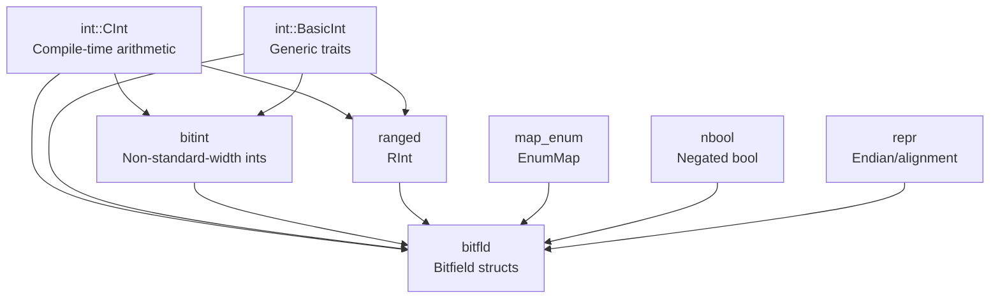

# ecore

[](https://crates.io/crates/ecore)
[](https://docs.rs/ecore)

**`ecore`** is a supplement to the standard `core` crate, focused on `no_std` environments (especially embedded/bare-metal scenarios). It provides bit-level operation capabilities that the standard library does not yet cover or stabilize: arbitrary-width integers, bitfield structs/enums, range-constrained value types, enum-to-array mapping, endianness adaptation, and more.

In embedded development, registers are typically laid out as fixed-width bitfields, but the Rust standard library only provides byte-granularity types like `u8/u16/u32/...`, lacking native support for non-aligned bits and non-standard-width integers. `ecore` fills this gap and establishes tight integration across its modules.

---

## Design Philosophy

`ecore`'s core design revolves around three goals:

1. **Fill `core`'s gaps** — Provide types and traits not yet stable or not planned in `core` (e.g., `u7`, compile-time integer arithmetic, bitfield definitions).
2. **Compile-time safety** — Push error checking to compile time as much as possible. Bit range overflow in bitfields, `RInt` value bounds violation, enum map index mismatch... all are compile errors.
3. **Module synergy** — Modules are not isolated tools; they share a trait system (`BasicInt`, `BitsCast`, `CInt`), producing compounding benefits when used together.

---

## Module Details

### `int` — Generic Integer Trait System & Compile-Time Arithmetic

The `int` module is the **cornerstone** of `ecore`. It defines a complete trait hierarchy that allows generic code to uniformly operate on all integer types (native + non-standard-width):

| Trait | Scope | Purpose |
|-------|-------|---------|
| `BasicInt` | `u1..u128`, `i1..i128`, `usize`, `isize` | Top-level abstraction for generic integers, includes all arithmetic/bitwise operators |
| `BasicUInt` | Unsigned subset of above | Generic constraint for unsigned integers |
| `BasicSInt` | Signed subset of above | Generic constraint for signed integers |
| `PrimaryInt` | `u8/u16/u32/u64/u128/i8/i16/i32/i64/i128/usize/isize` | Native integers (machine word width), the core operand type for `CInt` |
| `BitsOp` | All `BasicInt` implementors | Bit-level read/write operations, the foundation of `bitfld` |
| `CalcFitted` | Types adapted to machine computation width | Reduces code bloat from generic monomorphization |

#### `CInt` — The "Backdoor" for Compile-Time Integer Arithmetic

`CInt` is a collection of pure `const fn` static methods. Before `const_trait_impl` is stabilized, you cannot call trait methods like `Add::add` or `Shl::shl` in const contexts, yet embedded development heavily relies on compile-time computation (masks, offsets, constant folding).

`CInt` works around trait constraints by internally dispatching to native operators of concrete primitive types. The real value emerges in **generic const contexts** — where `const_trait_impl` would normally be required:

```rust
use ecore::int::{CInt, PrimaryInt, BasicInt};
use core::ops::Range;

/// Fixed-point value stored in the lower `FRAC` bits of a generic integer `T`.
/// The integer part occupies the upper `T::BITS - FRAC` bits.
struct Fixed<T: PrimaryInt, const FRAC: u32>(T);

impl<T: PrimaryInt, const FRAC: u32> Fixed<T, FRAC> {
    // ❌ Without CInt, this would NOT compile in const context:
    //    const INT_MASK: T = T::MAX << FRAC;  // error: trait method `shl` not const-stable
    //
    // ✅ CInt dispatches to the concrete primitive behind `T` at compile time:
    const INT_MASK: T = CInt::shl(T::MAX, FRAC);
    const FRAC_MASK: T = CInt::sub(CInt::shl(T::ONE, FRAC), T::ONE);
    const FRAC_RANGE: Range<T> = (CInt::sub(CInt::shl(T::ONE, FRAC), T::ONE))..T::ZERO;
    const INT_RANGE: Range<T> = (CInt::sub(T::ONE, CInt::shl(T::ONE, T::BITS - FRAC)))..T::ZERO;

    pub const fn from_parts(int: T, frac: T) -> Self {
        Self(CInt::bitor(CInt::shl(int, FRAC), frac))
    }
}
```

> **Key difference from `arbitrary-int`**: `arbitrary-int` also provides `u1`..`u127` types, but stores them internally as byte arrays, preventing `const fn` construction and arithmetic. `ecore`'s `BitInt` uses native integers as underlying storage (e.g., `u7` → `u8`), natively supporting `const` contexts and `const_default`, and integrates seamlessly with `CInt`.

### `bitint` — Non-Standard-Width Integers (vs `arbitrary-int`)

```rust
use ecore::bitint::{u3, u7, i12};

let a = u3::new(5).unwrap();          // 3-bit unsigned: 0..=7
let b = u7::new(100).unwrap();        // 7-bit unsigned: 0..=127
let c = i12::new(-1000).unwrap();     // 12-bit signed: -2048..=2047
```

| Dimension | `ecore::bitint` | `arbitrary-int` |
|-----------|-----------------|-----------------|
| **Underlying storage** | Native integer (`u7` → `u8`, `u12` → `u16`) | `[u8; N]` byte array |
| **const construction** | ✅ `const fn new()` | ❌ No `const` support |
| **Alignment/size** | Same as native type (1/2/4/8/16 bytes) | Byte-aligned, may have padding |
| **Arithmetic performance** | Native instructions (single `ADD`/`SUB`) | Software-emulated multi-byte ops |
| **Trait system** | Implements `BasicInt`, participates in generics | Independent type system |
| **Bitfield integration** | Usable directly as `#[bitfld]` field types | Requires manual conversion |
| **Compile-time computation** | Fully supported via `CInt` | Not supported |
| **Interop with standard ints** | `cast_as()` / `cast_from_primary()` | Requires `try_from()` |

> **Summary**: `arbitrary-int` suits arbitrary-precision scenarios exceeding 128 bits; `ecore::bitint` is optimized for embedded/systems programming, aiming for the same performance and const capabilities as native integers.

### `bitfld` — Bitfield Structs & Enums (vs `bitbybit`)

```rust
use ecore::bitfld::prelude::*;
use ecore::bitint::{u3, u4, u12};

// Define a 16-bit register
#[bitfld(u16, relative)]
struct MyReg {
    pub enable: bitfld!(bool, 0),         // 1 bit  at pos 0
    pub mode:   bitfld!(u3, 1..4),        // 3 bits at pos 1..3
    pub value:  bitfld!(u12, 4..),        // 12 bits at pos 4..15
}

let reg = MyReg(0)
    .enable().with(true)
    .mode().with(u3::new(5).unwrap())
    .value().with(u12::new(2048).unwrap());

assert!(reg.enable().read());
assert_eq!(reg.mode().read().value(), 5);
```

#### Bitfield Enums — Variants with Fields (tag+payload Packing)

```rust
use ecore::bitfld::prelude::*;
use ecore::bitint::{u2, u3, u4, u6};

// 6-bit enum: 2-bit tag + 4-bit payload, automatically packed
#[bitfld(u6, tag(u2), payload(u4))]
#[derive(Debug, PartialEq, Eq)]
enum Packet {
    Ack,                      // tag=0, no payload
    Read(u3),                 // tag=1, payload carries a u3 address
    Write(Unchecked<ErrorCode>), // tag=2, payload carries an enum value
    Nop(bool),                // tag=3, payload carries a bool flag
}

// A 2-bit error code enum usable as a variant field
#[bitfld(u2)]
#[derive(Debug, PartialEq, Eq)]
enum ErrorCode {
    Timeout = 0,
    Overflow = 1,
    BusError = 2,
}

// Construct and inspect
let pkt = Packet::Read(u3::new(5).unwrap());
assert_eq!(pkt, Packet::Read(u3::new(5).unwrap()));

// Decompose into raw tag+payload, useful for serialization
let bits: u6 = pkt.into_bits(); // packed 6-bit representation

// Re-layout tag and payload to different bit positions at zero cost
let relocated = pkt.into_layout::<u16, 4, 10>();
// tag at bits 4..6, payload at bits 10..14 in a u16
```

> With `tag(u2)` and `payload(u4)`, each variant's discriminant is packed into the tag bits, and its field value (if any) into the payload bits. The `BitsEnumReLayout` type enables zero-cost re-layout of tag/payload positions for different register formats.

#### Advanced Feature: Overlay Bitfields & `NBool`

```rust
use ecore::bitfld::prelude::*;
use ecore::bitint::u4;
use ecore::nbool::NBool;

#[bitfld(u32, overlay)]  // overlay allows field overlap
struct CtrlReg {
    pub byte0:   bitfld!(u8, 0..=7),
    pub low_nib: bitfld!(u4, 0..=3),   // overlaps with byte0's low 4 bits
    pub enabled: bitfld!(NBool, 8),    // NBool: zero value → true (ideal for default-enabled flags)
}

let reg = CtrlReg(0);                  // all zeros
assert!(reg.enabled().read().value()); // NBool(0) = true!
```

| Dimension | `ecore::bitfld` | `bitbybit` |
|-----------|-----------------|------------|
| **Definition style** | `#[bitfld(u32)]` attribute macro | `bitfield!` macro or builder |
| **Field types** | Any `BitsCast` type (bool/u7/i12/RInt/enum/array/NBool) | Only `bool` and standard integers |
| **Overlay bitfields** | ✅ Supports field overlap (e.g., byte + nibble sharing bits) | ❌ |
| **Bitfield enums** | ✅ tag+payload packing | ❌ |
| **Dynamic bitfields** | `DynBitField` (runtime offset access) | ❌ |
| **Endian-awareness** | `relative`/`overlay` modes, integrated with `repr` module | Fixed LE/BE |
| **const read/write** | ✅ `const_read()` / `const_with()` | Limited support |
| **bytemuck integration** | Auto-derives `Pod`/`Zeroable` (primary-width types) | Manual implementation required |
| **Array fields** | `bitfld!([bool; 4], 8..=11)` | ❌ |
| **Generic bitfields** | `BitField2<S1, S2, F1, F2>` spanning two storage units | ❌ |

> **Summary**: `bitbybit` suits simple bitfield packing scenarios; `ecore::bitfld` provides complete register-level modeling (overlay, enums, dynamic bitfields), deeply integrated with `bitint`/`ranged`/`repr`.

#### `Uncheckable` / `Unchecked` — Deferred Validation

Many field types in bitfields store raw bits without runtime validation, deferring checks to read time. This is handled by the `Uncheckable` trait and `Unchecked<T>` wrapper:

```rust,ignore
use ecore::repr::Unchecked;
use ecore::int::ranged::rint;

// RInt values are `Uncheckable`, so `Unchecked<RInt<...>>` stores the raw
// bit pattern. Validation only occurs when `.get()` is called on read:
let checked = rint!(0..=100, bits=7)::new(50).unwrap();
let raw: Unchecked<_> = checked.into();       // store without validation
assert_eq!(raw.get(), Ok(checked));           // validate on read
```

> `Unchecked<T>` is the recommended way to use `RInt` and other constrained types as `#[bitfld]` fields, since the outer `#[bitfld]` machinery already guarantees bit-level correctness.

#### `DynBitField` — Runtime Dynamic Bit-Field Access

`DynBitField<FLD>` provides type-erased bit-field read/write at runtime-determined bit offsets, while `DynBitField<FLD, STRUCT>` is the typed variant (MIRI-safe). Both are accessible via `.as_ref()` / `.as_mut()` on any `BitField`:

```rust,ignore
# use ecore::bitfld::prelude::*;
# use ecore::bitint::u7;
# #[bitfld(u32)] struct Reg { pub f: bitfld!(u7, 0..=6) }
let reg = Reg(0);
let dyn_ref: &DynBitField<u7, Reg> = reg.f().as_ref(); // typed, MIRI-safe
```

#### `BitField2` — Split Fields Across Storage Units

When a single logical field spans two non-contiguous bit ranges (common in fragmented hardware registers), `#[bitfld]` auto-generates a `BitField2<S1, S2, F, START1, LAST1, START2, LAST2>` instead of `BitField`. Reading and writing transparently handles the split.

### `varint` — Variable-Length Integer Encoding

```rust,ignore
use ecore::int::VarInt;

// Encode a u32 into a stack-allocated buffer
let mut buf = [0u8; VarInt::max_bytes_of::<u32>()];
let bytes = VarInt::encode(300u32, &mut buf);
assert_eq!(bytes, &[0xAC, 0x02]); // Protobuf-style 7-bit encoding

// Decode back
let (val, len) = VarInt::decode_unsigned::<u32>(bytes).unwrap();
assert_eq!((val, len), (300, 2));

// Zigzag encoding for signed integers
let (val, len) = VarInt::decode_signed::<i32>(bytes).unwrap();
```

Uses a 7-bit-per-byte encoding scheme (high bit = continuation), compatible with Protocol Buffers varint. All encode/decode operations are `const fn`, suitable for compile-time protocol construction.

### `ranged` — Compile-Time Range-Constrained Value Type `RInt`

```rust
use ecore::bitint::{u4, u7};
use ecore::int::ranged::{RInt, RRU16, RRU8, rint};

// Define a 7-bit storage type for values 0..=100
type Percentage = RInt<u7, RRU16<0, 100, 0>>;

let p = Percentage::new(50).unwrap();
assert_eq!(p.value(), 50);
// Percentage::new(101); // rejected at compile time!

// rint! macro simplifies definition
type Volume = rint!(0..=11, bits=4); // 0..=11 stored in u4
```

**Key advantages**:

- **Compile-time bounds checking**: `new()` rejects out-of-range values at compile time.
- **Storage compression**: A value range of `0..=100` only needs 7 bits (`u7`), not a full `u8`. In `#[bitfld]`, this directly translates to more compact register layouts.
- **Step support**: `RInt<u7, RRU16<0, 100, 0, 5>>` represents `{0, 5, 10, ..., 100}`, ideal for enumerated configuration values.
- **Bitfield integration**: `RInt` implements `BitsCast` and can be used directly as a `#[bitfld]` field type.

```rust
use ecore::bitfld::prelude::*;
use ecore::bitint::{u4, u7};
use ecore::int::ranged::{RInt, RRU8, rint};

// Using RInt in bitfields: automatic bit-width compression
#[bitfld(u16)]
struct Config {
    pub volume: bitfld!(Unchecked<rint!(0..=11, bits=4)>, 0..=3),  // only 4 bits
    pub rate:   bitfld!(Unchecked<rint!(0..=100, bits=7)>, 4..=10), // only 7 bits
}
```

### `map_enum` — Efficient Enum-to-Array Mapping

```rust
use ecore::{EnumMap, MapEnum, map_enum};

#[derive(MapEnum)]
enum Color { Red, Green, Blue }

// EnumMap is an array indexed by enum variants
let map = EnumMap::<Color, &str>::map_new(|c| match c {
    Color::Red   => "Red",
    Color::Green => "Green",
    Color::Blue  => "Blue",
});

assert_eq!(map[Color::Green], "Green");
```

**Key advantages**:

- **Zero-overhead indexing**: Enum discriminant values serve directly as array indices, `O(1)` access with no hashing and no branching.
- **Compile-time safety**: The number of enum variants and array size are bound at compile time, preventing out-of-bounds access.
- **`map_enum!` macro**: Supports const-context lookup table construction:

```rust,ignore
const NAMES: EnumMap<Color, &str> = map_enum!(
    Color::Red   => "Red",
    Color::Green => "Green",
    Color::Blue  => "Blue",
);
```

- **`IterEnumDiscriminants`**: `#[derive(IterEnumDiscriminants)]` generates a compile-time iterator over all variant names and discriminant values, useful for debug formatting, serialization, and lookup table generation.

- **Bitfield enum synergy**: Bitfield enums also implement `MapEnum`, enabling direct construction of register-field-to-description lookup tables.
- **`remap` / `transparent_wrap`**: Reinterpret the same underlying array under a different enum key type (`remap`), or wrap/unwrap with `bytemuck::TransparentWrapper` for zero-cost newtype patterns.

```rust,ignore
# use ecore::{EnumMap, MapEnum};
# #[derive(MapEnum)] enum A { X, Y }
# #[derive(MapEnum)] enum B { P, Q }
let map_a: EnumMap<A, u32> = EnumMap::map_new(|_| 0);
let map_b: &EnumMap<B, u32> = map_a.remap(); // same memory, different key type
```

### `repr` — Endianness & Alignment Adaptation

```rust
use ecore::repr::{LEndian, BEndian, Unalign};
use ecore::repr::AlterRepr;

// Fixed little-endian (regardless of target endianness)
let val = LEndian(0x12345678u32);
assert_eq!(<LEndian<u32> as AlterRepr<u32>>::into_std_repr(val), 0x12345678);

// Unaligned access (packed)
let unaligned: Unalign<u32> = Unalign(42);

// Combined: unaligned + little-endian
type PacketHeader = Unalign<LEndian<u32>>;
```

In embedded scenarios, peripheral registers may use a different endianness than the CPU, or reside at unaligned addresses. The `repr` module provides compile-time endian conversion and `packed` representation, enabling bitfield modeling of registers with arbitrary endianness when combined with `bitfld`.

### `nbool` — Negated Boolean

```rust
use ecore::nbool::NBool;

// NBool(false) = true, NBool(true) = false
// Zero-initialized memory defaults to true (ideal for enable/active type flags)
let flag = NBool::new(true);  // internally stored as 0
```

In embedded registers, many "enable" flags reset to 1 (enabled). `NBool` allows zero-initialized memory to correctly express this semantic, avoiding forgotten critical enable bits.

---

## The Power of Module Synergy

The true power of these modules emerges when **combined**. Here is a real-world scenario:

```rust,ignore
use ecore::bitfld::prelude::*;
use ecore::bitint::{u3, u4, u7};
use ecore::int::ranged::{RInt, RRU16, rint};
use ecore::repr::Unalign;
use ecore::nbool::NBool;
use ecore::MapEnum;

// 1️⃣ Define opcodes with an enum (map_enum for later lookup table)
#[derive(MapEnum, Debug, PartialEq, Eq)]
enum OpCode {
    Nop   = 0,
    Read  = 1,
    Write = 2,
    Reset = 3,
}

// 2️⃣ Define a 16-bit command word with bitfld (bitint + ranged + nbool combined)
#[bitfld(u16)]
#[derive(Debug, Default)]
struct Command {
    pub op:     bitfld!(u3, 0..=2),                          // bitint: 3-bit unsigned
    pub ch:     bitfld!(Unchecked<rint!(0..=15, bits=4)>, 3..=6), // ranged: channel 0..15 compressed to 4 bits
    pub enable: bitfld!(NBool, 7),                            // nbool: zero → true
    pub data:   bitfld!(u7, 8..=14),                          // bitint: 7-bit data
    pub parity: bitfld!(bool, 15),                            // parity
}

// 3️⃣ Build a command
let cmd = Command::default()
    .with_op(u3::new(OpCode::Write as u8).unwrap())
    .with_ch(Unchecked::from(7u8))  // RInt requires Unchecked wrapper
    .with_enable(true)               // NBool: true → stored as 0
    .with_data(u7::new(100).unwrap())
    .with_parity(false);

// 4️⃣ EnumMap lookup table: opcode → description
const DESCS: EnumMap<OpCode, &str> = ecore::map_enum!(
    OpCode::Nop   => "No operation",
    OpCode::Read  => "Read",
    OpCode::Write => "Write",
    OpCode::Reset => "Reset",
);

// 5️⃣ Extract opcode from command word and look up description
let op_val = cmd.op() as u8;
let op = OpCode::from_index(op_val as usize);
println!("Executing: {}", DESCS[op]);

// 6️⃣ Read/write from register slots (repr handles unaligned access)
let mut buf: [Unalign<u16>; 4] = Default::default();
buf[0] = Unalign(cmd.0);
```

**Module collaboration relationships:**



- `CInt` provides the "infrastructure" of compile-time computation for all modules
- `BasicInt` trait allows `bitint`'s non-standard integers to be used indistinguishably from native integers in generic code
- `bitint` + `ranged` + `nbool` can all directly serve as `bitfld` field types
- `map_enum` pairs with `bitfld` enums to achieve zero-overhead register-value-to-semantic-description mapping
- `repr` handles endianness/alignment, ensuring `bitfld`-modeled registers match actual memory layout

---

## Relationship with the `core` Standard Library

| `core` provides | `ecore` supplements |
|-----------------|---------------------|
| `u8/u16/u32/u64/u128` native integers | `u1..u127` / `i1..i127` non-standard-width integers (`bitint`) |
| Integer traits (`Add`, `Shl`, ...) | Unified `BasicInt` trait system (`int`) |
| Runtime integer arithmetic | Compile-time `CInt` arithmetic (substitute before `const_trait_impl` stabilizes) |
| No built-in varint encoding | Protobuf-style `VarInt` const encode/decode (`varint` feature) |
| Enum `#[repr(usize)]` + array | `EnumMap<Enum, T>` type-safe mapping (`map_enum`) |
| Bit operations (`bitand`, `shl`, ...) | Bitfield `#[bitfld]` struct/enum (`bitfld`) |
| Memory endianness (`to_le`/`to_be` methods) | Endianness type wrappers (`repr::LEndian`/`BEndian`) |
| `bool` | `NBool` negated boolean (`nbool`) |
| `NonZero` family | Compile-time range-constrained `RInt` (`ranged`) |

---

## Features

| Feature | Default | Description |
|---------|---------|-------------|
| `bitint` | ✅ | Non-standard-width integers: `u1`, `u3`, `u7`, `i12`, etc., backed by native primitives |
| `bitfld` | ✅ | `#[bitfld(u32)]` bitfield structs/enums with overlay, dynamic bitfields, tag+payload |
| `ranged-int` | ✅ | `RInt<STORE, RANGE>` — compile-time bounds checking and storage compression |
| `varint` | | Variable-length integer encoding/decoding (similar to Protobuf varint) |

## Quick Example

```rust
use ecore::bitfld::prelude::*;
use ecore::bitint::{u3, u12};

// Define a 16-bit register
#[bitfld(u16, relative)]
struct MyReg {
    pub enable: bitfld!(bool, 0),
    pub mode:   bitfld!(u3, 1..4),
    pub value:  bitfld!(u12, 4..),
}

let reg = MyReg(0)
    .enable().with(true)
    .mode().with(u3::new(5).unwrap())
    .value().with(u12::new(1024).unwrap());

assert!(reg.enable().read());
assert_eq!(reg.mode().read().value(), 5);
```

## Modules

- **`int`** — `BasicInt`/`BasicUInt`/`BasicSInt` generic traits; `BitsOp` bit-level operations; `CInt` compile-time integer arithmetic
- **`bitint`** — Non-standard-width integers `u1`..`u127`, `i1`..`i127`, zero-overhead abstraction
- **`bitfld`** — `#[bitfld]` bitfield structs/enums, dynamic bitfields `DynBitField`, tag+payload re-layout
- **`ranged`** — `RInt` compile-time value-range-constrained integers with storage compression and step support
- **`map_enum`** — `EnumMap` enum-to-array mapping, `map_enum!` const construction macro
- **`repr`** — `LEndian<T>`/`BEndian<T>`/`Unalign<T>` endianness and alignment adaptation
- **`nbool`** — `NBool` negated boolean (zero value → true)
- **`varint`** — `VarInt` Protobuf-style variable-length integer encoding/decoding, all `const fn`
- **`range`** — `BitsRange` efficient bit-range description and cross-byte copying

## MSRV

Rust 1.87+

## License

MIT — see [repository](https://github.com/pbl-pw/ecore) for full license.
